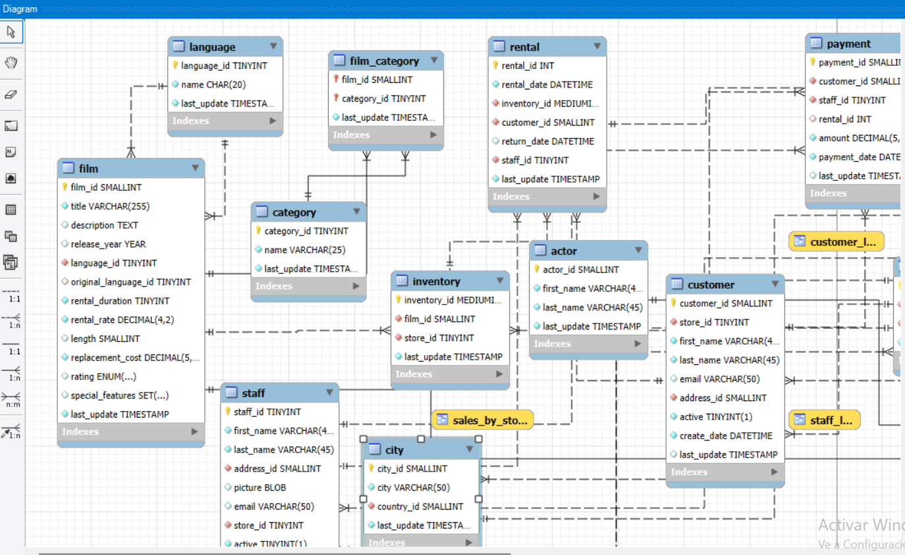
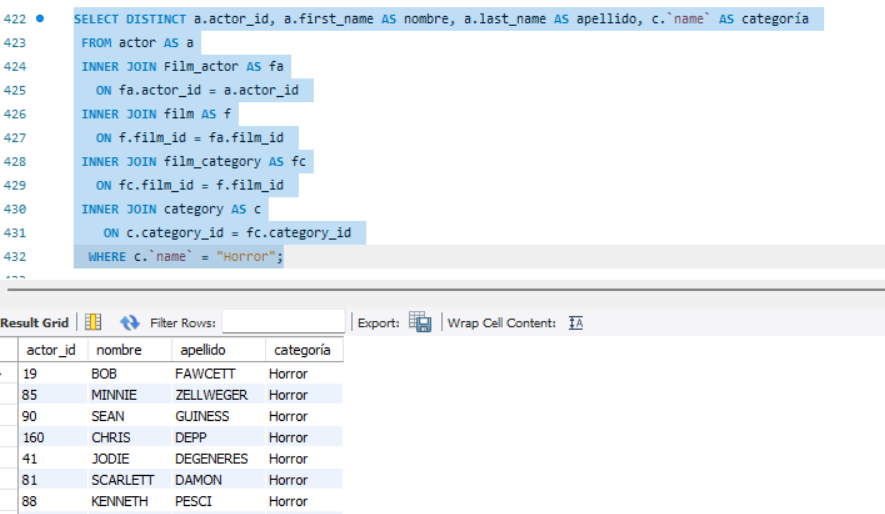

# 🎬 Análisis SQL — Base de datos Sakila (Videoclub)

## Descripción
Proyecto de análisis de datos sobre la base de datos **Sakila**, que simula el funcionamiento de una tienda de alquiler de películas. El objetivo es extraer, analizar y relacionar información mediante consultas SQL de distinta complejidad.

## Tecnologías


## Estructura del repositorio
```
videoclub-sakila-SQL/
│
├── README.md
├── sakila_queries.sql   # Consultas SQL del proyecto
└── img/
    ├── diagrama_sakila.png    # Diagrama de la base de datos
    └── ejemplo_query.png      # Ejemplo de consulta y resultado
```

## Sobre la base de datos
Sakila contiene información estructurada sobre un videoclub, con tablas como:
- `film` — títulos, duración, año de lanzamiento
- `actor` — datos de actores
- `customer` — información de clientes
- `rental` — registros de alquileres



## Consultas incluidas
El archivo `sakila_queries.sql` cubre:
- Filtrado y selección con `WHERE`, `DISTINCT`
- Joins entre múltiples tablas
- Subconsultas
- Funciones de agregación (`COUNT`, `AVG`, `SUM`)
- Ordenación y agrupación (`ORDER BY`, `GROUP BY`)
- Funciones de fecha (`DATEDIFF`)



## Autora
**Elena Pavón Fernández**  
Proyecto de evaluación — Módulo 2, Adalab Data Analytics Bootcamp